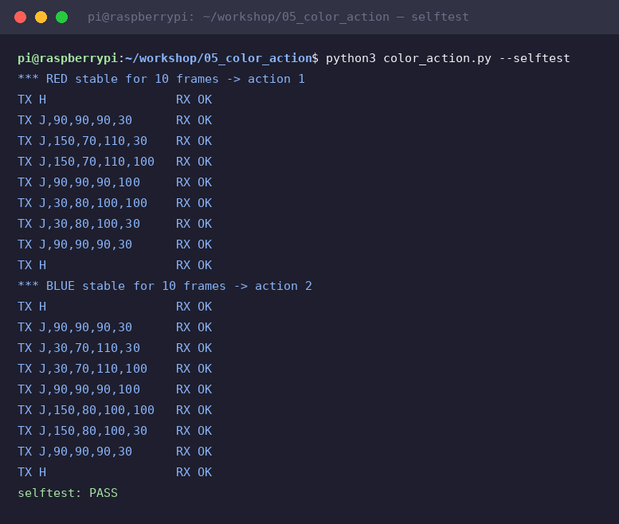

# Module 5 — Example A: color → arm action

NEW example (not in the deck) · Result: hold something **red** in front of the camera and
the arm plays **action 1**; hold **blue** and it plays **action 2**. First demo where the
robot *reacts to what it sees*.

This module adds **zero new hardware** and **zero firmware changes** — it is pure glue
between module 4 (see), module 2 (talk) and module 3 (move):

```
camera frame ─▶ red/blue masks ─▶ 10 stable frames? ─▶ pose sequence ─▶ J,... ─▶ OK ─▶ next pose
```

## 1. Run it

```bash
cd ~/workshop/05_color_action
python3 color_action.py              # live: watch red and blue at the same time
python3 color_action.py --dry-run    # no Arduino? prints the commands instead
python3 color_action.py --selftest   # synthetic frames through the SAME brain
```

`--selftest` pushes 14 synthetic red frames and 14 blue ones through the real decision
code and the real serial link, and prints `selftest: PASS` when red fired action 1 and
blue action 2. Run it first — it proves the brain before you blame the camera.

Verified on the bench Pi — 18 commands over the real USB-serial link to the
Nano, every single one answered `OK`:



## 2. How it decides (the interesting 20 lines)

1. Every frame (~5 fps is plenty), [`see()`](../code/05_color_action/color_action.py)
   runs the module-4 pipeline **for red and blue simultaneously** — red uses its two
   hue ranges (0–10 and 170–179), blue one.
2. A color must survive **10 frames in a row** (the anti-flicker guard from deck slide 39)
   before anything happens — a passing red shirt does not trigger the arm.
3. On trigger, `play()` sends `H` then each pose of the action, **waiting for `OK`
   before the next step** — the sequence can never outrun the arm (slide 38).
4. A **3 s cooldown** after an action ignores new detections while the arm settles.

## 3. The action scripts

`ACTIONS` at the top of the file maps each color to a list of poses — those are the two
"programs". The ones shipped are examples reaching left/right and dropping over a bin.
Find YOUR numbers with module 3's `calibrate.py`, then edit the tuples:

```python
ACTIONS = {
    "red":  [(90, 90, 90, 30),   # home
             (150, 70, 110, 30), # reach left  <- your calibration
             ...],
    "blue": [...],
}
```

Want a third behavior? Add `"green"` to `RANGES` usage in `see()` and a `"green"` action —
the state machine is generic. (Green is also what the PickBot finale uses, so it's a nice
bridge to module 7.)

## 4. Testing procedure (do it in this order)

| Step | Command | Pass when |
|---|---|---|
| 1 | `python3 color_action.py --selftest` | `selftest: PASS` (red→action1, blue→action2, arm answered OK to every J) |
| 2 | `python3 color_action.py --dry-run` + red object in view | `watching: red@(x,y)` lines, then TX lines for action 1 |
| 3 | same with blue | action 2 TX lines |
| 4 | full power, `python3 color_action.py` | arm physically runs the sequence |
| 5 | wave the object past quickly | **nothing** happens (10-frame guard) |

## 5. Classroom script

1. Run with `--dry-run`, show the `watching:` line reacting to a red pen — vision only.
2. Plug the arm in, rerun without `--dry-run`: same pen now moves the whole arm.
3. Ask: *"what should blue do?"* — edit two lines, rerun. That's the moment they get it:
   **the robot's behavior is now a Python dict.**
4. Let each team pick its own second action.

**Troubleshooting**

| Symptom | Fix |
|---|---|
| Fires at the wrong moment | Raise `STABLE_FRAMES`; check no red/blue clothes in frame |
| Fires twice | `COOLDOWN_S` too short |
| `!! arm reported an error` | A pose hit a joint limit — recalibrate that pose |
| Never fires in the room light | Re-tune the HSV ranges (module 4, `hsv_tune.py`) |

## What you learned

- "Behavior" = detect → debounce → sequence → wait-for-OK. Every reactive robot you'll
  ever build looks like this loop.
- Keeping the Nano thin means new behaviors are Python edits, not re-flashing.

Next: [Module 6 — Example B: hand gestures → arm commands](06-gestures.md)
