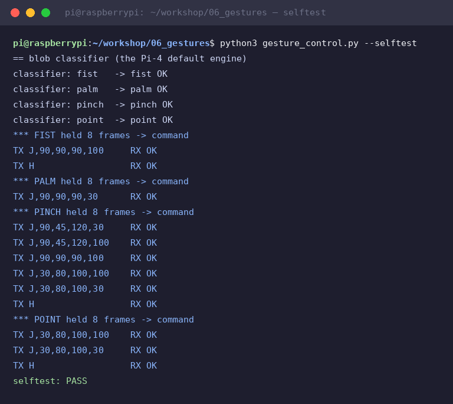

# Module 6 — Example B: hand gestures → arm commands

NEW example (not in the deck) · Result: make a gesture at the camera and the arm obeys.

| Gesture | Command |
|---|---|
| ✊ fist | close gripper + go home ("grab it") |
| 🖐 open palm | open gripper ("drop it") |
| 🤏 pinch | run the full pick sequence |
| ☝ point (one finger) | release over the bin |

Same brain as module 5: **hold 8 frames → send J-commands → wait for OK → cooldown**.
Two engines produce the same four gesture names — pick by hardware:

## 1. The engine story (read this once)

- **Pi 4 (our kit): use the glove engine.** Reality check from our own bench: the only
  mediapipe wheels for Python 3.13 aarch64 are 1.0.x, and they die with **SIGILL**
  (Illegal instruction) on the Pi 4's Cortex-A72 — the wheel assumes newer CPU
  instructions. `auto` therefore always picks the glove engine.
- **Pi 5: you may force `--engine mediapipe`** — MediaPipe Hands finds 21 landmarks and
  the same gestures come from plain geometry (tip farther from wrist than the middle
  knuckle = finger extended; thumb+index tips touching = pinch).

## 2. Glove engine (default) — pure module-4 skills

Kit item: **one colored glove** (yellow default; any color in the table works —
`--glove-color red|blue|green|yellow`). Why a glove? Skin detection breaks with
lighting; a colored surface makes hand blobs as reliable as the cube tracking was.

The glove turns gestures into **blob counting**:

| You show | Camera sees | Gesture |
|---|---|---|
| fist | one BIG blob (whole glove) | fist |
| one fingertip | one small blob | point |
| thumb+index touching | one merged ~2× blob | pinch |
| open hand | 4–5 separate fingertip blobs | palm |
| 2–3 blobs (hand moving) | — | ignored (transition) |

Three area thresholds at the top of [`gesture_control.py`](../code/06_gestures/gesture_control.py)
(`TIP_MIN / PINCH_MIN / FIST_MIN`) need one tuning pass for your glove and distance:
run the tool, read the printed `tips: [areas]`, adjust, done.

```bash
cd ~/workshop/06_gestures
python3 gesture_control.py --selftest            # classifier + commands, no camera
python3 gesture_control.py --engine glove        # live
python3 gesture_control.py --engine glove --glove-color red
python3 gesture_control.py --dry-run             # print commands, don't send
```

Verified on the bench Pi — blob classifier 4/4 (fist/palm/pinch/point) and all
four command sequences answered `OK` by the Nano:



## 3. MediaPipe engine (Pi 5 path), for reference

```bash
python3 -m venv --system-site-packages ~/workshop/venvs/gestures
~/workshop/venvs/gestures/bin/pip install mediapipe
curl -L -o ~/workshop/06_gestures/hand_landmarker.task \
  https://storage.googleapis.com/mediapipe-models/hand_landmarker/hand_landmarker/float16/1/hand_landmarker.task
~/workshop/venvs/gestures/bin/python gesture_control.py --engine mediapipe
```

mediapipe 1.x note: the old `mp.solutions` API is **gone** — 1.x uses the Tasks API
(`HandLandmarker.create_from_options`), which our code demonstrates. The 7.8 MB
`.task` model stays out of git (`.gitignore`), hence the curl step.

## 4. Testing procedure

| Step | Command | Pass when |
|---|---|---|
| 1 | `python3 gesture_control.py --selftest` | `classifier:` 4×OK and `selftest: PASS` (all four commands fired, arm answered OK) |
| 2 | `--dry-run --seconds 30`, show each gesture | correct `*** GESTURE held 8 frames` lines |
| 3 | live with arm powered | arm runs each command |
| 4 | wave hand randomly | nothing fires (8-frame hold + 2–3-blob ignore) |

## 5. Classroom script

1. Selftest on the projector: gestures → TX lines → OKs. "The robot's vocabulary is a
   Python dict — change what fist means and it changes."
2. One volunteer wears the glove; class watches `tips: [areas]` numbers change live —
   they SEE the blob areas, thresholds stop being magic.
3. Swap gesture meanings in `COMMANDS`, rerun, 30 seconds to re-test.

**Troubleshooting**

| Symptom | Fix |
|---|---|
| `tips: []` with glove in view | Wrong color / too dark — retune HSV (`hsv_tune.py --headless`), or lighter glove |
| pinch reads as point | Merged blob too small — raise `PINCH_MIN` or touch tips tighter |
| palm reads as pinch | Fingers too close — spread them; or raise `PINCH_MIN` |
| fist never fires | Glove blob < `FIST_MIN` — lower it (print the area first) |

## What you learned

- Gesture recognition = detection + a small state machine, not magic.
- Constraint-driven design: the Pi 4 CPU decided our engine — engineers adapt the plan
  to the hardware, not the other way around.

Next: [Module 7 — PickBot: the full vision-guided arm](07-pickbot.md)
