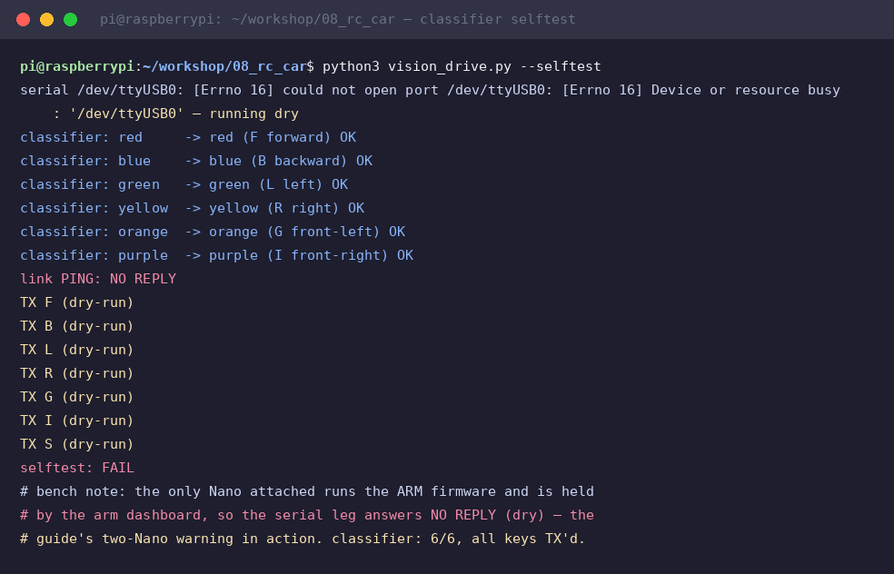
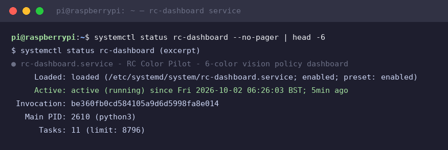
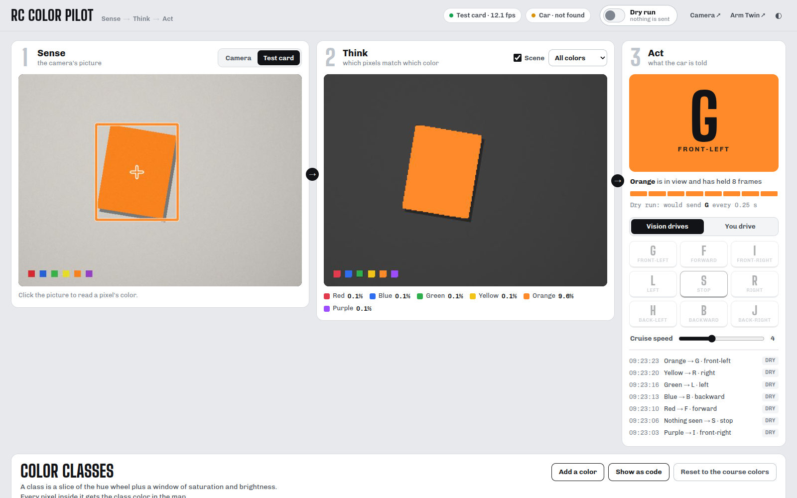
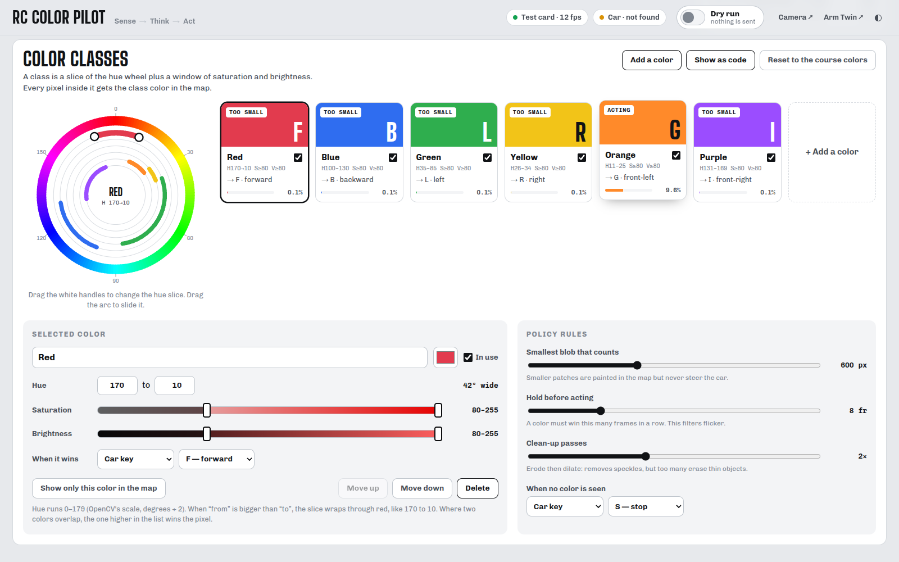
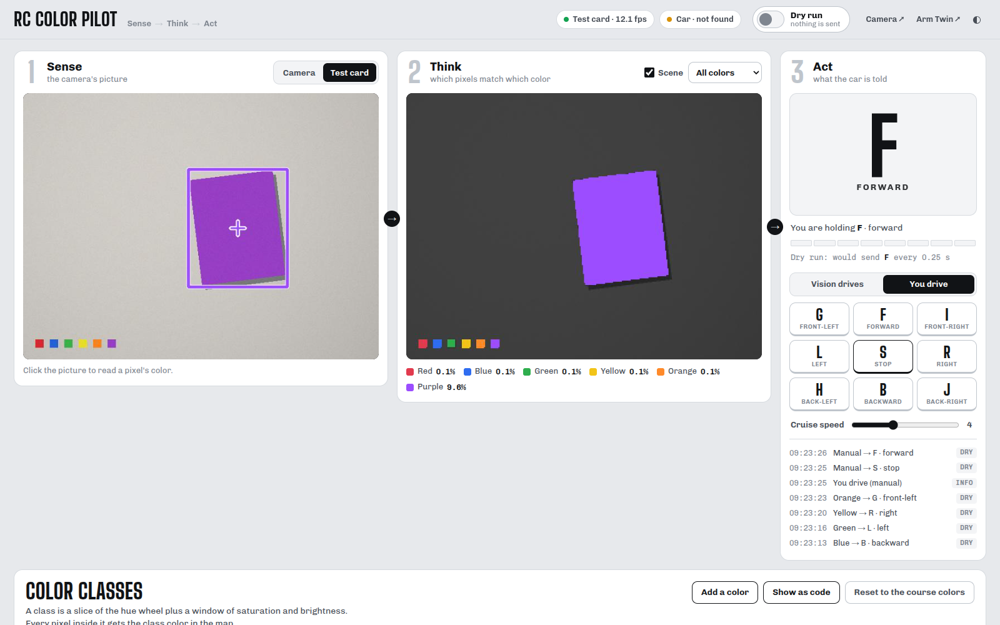
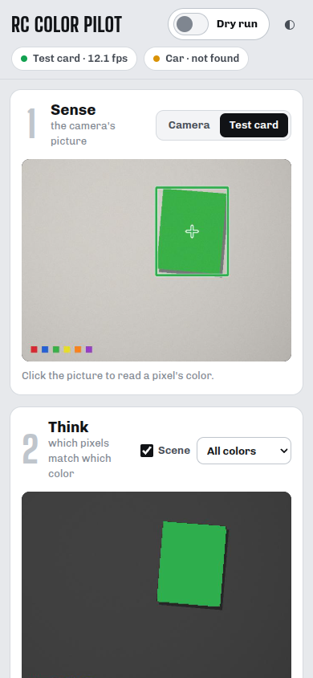
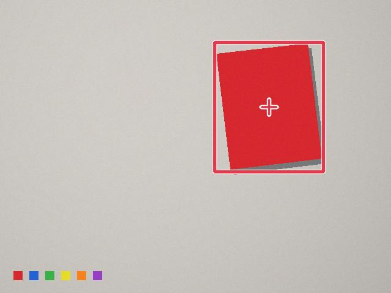
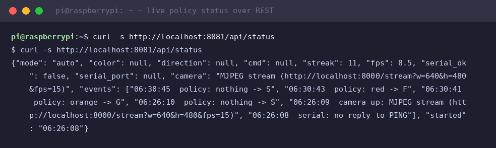

# Module 8 — RC Color Pilot: a vision-driven robot car

NEW project (RC Car 101 kit + everything from modules 1–7) · Result: show a colored
card to the car's camera and it drives — 6 colors, 6 directions, live dashboard.

## The AI you are actually teaching (say these words)

This car is an **autonomous agent** running the **sense–think–act loop** — the same
architecture as a self-driving car, at toy scale:

| Stage | What happens here | AI vocabulary |
|---|---|---|
| Sense | camera frame | **observation** |
| Think (perception) | HSV mask per pixel → biggest blob + centroid | **pixel-level color segmentation** (a *rule-based classifier*), then **object detection & localization** |
| Think (decision) | color → driving command table | **policy** — a **rule-based / reactive agent** |
| Act | `F`/`B`/`L`/`R`… over UART → motors | action |
| Stability | color must hold 8 frames | **temporal smoothing / debouncing** |

The honest one-liner: *the pipeline shape is identical to deep learning — input →
features → classification → decision → action — we tune the classifier by hand (HSV
thresholds) instead of by gradient descent.* Swap the threshold classifier for a
trained detector later and nothing else changes.

## Hardware — the RC Car 101 kit

Arduino Nano (or Uno) · L298N motor driver · 4× DC motors + wheels · chassis ·
battery pack · Raspberry Pi + camera mounted on the car (Pi powered by its own
pack/bank).

⚠️ A Nano is a one-role brain: the PickBot arm Nano runs arm firmware, the car Nano
runs car firmware. Two projects, two Nanos (or re-flash when you switch).

### Wiring (L298N → Arduino, from the RC-101 guide)

| L298N | Arduino | Job |
|---|---|---|
| ENA | D5 | left-side speed (PWM) |
| IN1 / IN2 | D6 / D7 | left-side direction |
| IN3 / IN4 | D8 / D9 | right-side direction |
| ENB | D10 | right-side speed (PWM) |
| GND | GND | common ground with the battery − |

Left two motors parallel on OUT1/2, right pair on OUT3/4. Motors run on their own
battery — never from the Arduino 5 V pin.

## Firmware — RC-101 evolved

[`code/08_rc_car/car_firmware/car_firmware.ino`](../code/08_rc_car/car_firmware/car_firmware.ino)
keeps everything from the RC-101 phone-app code (same `F B L R G I H J S 1-9 q` keys,
same pins) and adds what a robot with a brain needs:

1. a **line protocol** for the Pi: `D,<left>,<right>` (−255..255, replies `OK`/`ERR`),
   `PING` → `OK`
2. **clamping** of every value
3. a **fail-safe**: no command for 900 ms → motors stop. A moving robot must never
   keep driving when its brain goes quiet.

Upload (Pi USB; HC-05 unplugged if fitted — same warning as RC-101):

```bash
scp -r code/08_rc_car pi@raspberrypi.local:workshop/
ssh pi@raspberrypi.local
~/.local/bin/arduino-cli compile --fqbn arduino:avr:nano:cpu=atmega328old ~/workshop/08_rc_car/car_firmware
~/.local/bin/arduino-cli upload  -p /dev/ttyUSB0 --fqbn arduino:avr:nano:cpu=atmega328old ~/workshop/08_rc_car/car_firmware
```

Using the HC-05 phone app instead of the Pi? Set `BAUD 9600` in the sketch header.

## The policy — 6 colors → 6 directions

| Card | Key | Action | | Card | Key | Action |
|---|---|---|---|---|---|---|
| 🔴 red | `F` | forward | | 🟢 green | `L` | left |
| 🔵 blue | `B` | backward | | 🟡 yellow | `R` | right |
| 🟠 orange | `G` | front-left | | 🟣 purple | `I` | front-right |
| nothing in view | `S` | stop | | | | |

The letters are literally the RC-101 app's keys — one firmware, two brains (phone or
Pi). Tune shades with module 4's `hsv_tune.py`; print a card set in these six colors.

## Run it

```bash
cd ~/workshop/08_rc_car
python3 vision_drive.py --selftest     # 6/6 classifier + PING + all keys sent
python3 vision_drive.py --dry-run      # camera in, commands printed
python3 vision_drive.py                # live: cards drive the car
python3 dashboard/server.py            # the dashboard (below)
```

Verified on the bench Pi (2026-10-02 session) — classifier 6/6 and every key
transmitted. The serial leg honestly reports `NO REPLY` here: the only Nano
attached runs the **arm** firmware (module 3) and is held by the arm dashboard,
which is exactly the two-Nano warning above in action. With a car Nano flashed
and free, the same run answers `link PING: OK` and ends `selftest: PASS`:



## The dashboard — http://raspberrypi.local:8081/

Third member of the Pi dashboard family (8000 camera · 8080 Arm Twin · 8081 this).
The page lays the sense–think–act loop out left to right, and **the classifier is
editable while the car runs**: that is the lesson.

| Panel | What students see |
|---|---|
| **1 Sense** | the camera picture, or a built-in **test card** (a hand-held card that changes color every few seconds). Click any pixel to read its H S V |
| **2 Think** | the **segmentation map**: every pixel painted with the color class it matched, the rest of the scene greyed out; show one class at a time |
| **3 Act** | the command as a big signal card in the winning color, the **hold meter** (temporal smoothing, frame by frame), what goes down the wire, AUTO / MANUAL, the hold-to-drive D-pad, cruise speed, the event log |

Below it, **Color classes**: a hue wheel where every class owns a slice of the
spectrum (red's slice crosses 0), a swatch card per class with its live share of the
picture, and an editor:

- drag the wheel handles (or type 0–179) to set the hue slice; dual sliders set
  saturation and brightness. The map repaints while you drag
- **click a pixel → "Add as a new color"** builds a class around that shade;
  **"Teach ‹class› this shade"** stretches an existing class to cover it
- **When it wins** picks the action: an RC key (`F B L R G I H J S`), any serial
  line (`D,150,150` …), a saved **Arm Twin pose** (vision moves the arm, which works
  with the arm's Nano alone), or nothing
- policy rules: the smallest blob that counts, how many frames a color must hold,
  clean-up passes (erode/dilate), what to do when nothing is seen
- **Show as code** prints `RANGES` and `DIRECTIONS` for `color_track.py` and
  `vision_drive.py`, so the command-line scripts see the colors you tuned

Edits are saved on the Pi (`data/vision.json`); **Reset to the course colors** brings
back the six cards. **Output starts OFF (dry run) after every restart**: the page shows
what it *would* send until you flip the switch, and Space or Esc turns it off again.
While a key is active it is re-sent every 250 ms, so the firmware's 900 ms fail-safe
keeps the car moving only as long as the dashboard keeps deciding.

The car link finds the car's Nano by asking every free USB serial port `PING` and
using the one that answers `OK`. Ports another program holds (the Arm Twin keeps the
arm's Nano) are skipped, and the car lamp's tooltip names them.

Installed as `rc-dashboard.service` (auto-starts on boot), source of truth in
[`code/08_rc_car/`](../code/08_rc_car/), deployed copy in `~/Desktop/rc-dashboard/`
(`dashboard/install.sh` refreshes it and keeps `data/`):



**Live on the bench Pi.** The test card in AUTO: the camera view boxes the winning
card and marks its centre, the map paints it orange, and the Act card says **G**
(front-left) once the hold meter is full. The six tiny chips at the bottom are
segmented too, but they are smaller than the minimum blob, so they never steer:



The classifier: hue wheel, swatch cards with live coverage, the editor and the
policy rules:



MANUAL: you drive with the D-pad (press and hold; release stops):



It works on a phone, too:



One annotated frame straight from `/snapshot.jpg` (what the policy sees;
`/snapshot.jpg?view=mask` gives the segmentation map):



And the whole state machine readable over one REST call: mode, verdict, streak,
fps, camera source and the event log in a single JSON document:



REST API for experiments: `/api/status`, `/api/config` (GET and POST),
`/api/sample?x=0.5&y=0.5`, `/api/output`, `/api/mode`, `/api/drive`, `/api/speed`,
`/api/source`, `/api/serial`, `/snapshot.jpg?view=camera|mask`,
`/stream?view=camera|mask` (MJPEG). The first version's `/api/cmd?k=F`,
`/api/mode?m=manual` and `/api/speed?n=5` still work.

## Testing procedure (in this order)

| Step | Command / action | Pass when |
|---|---|---|
| 1 | `python3 vision_drive.py --selftest` | 6× `classifier: … OK`, `link PING: OK`, `PASS` |
| 2 | dashboard up, open 8081 | picture shows, the "Camera · 15 fps" lamp is green |
| 3 | switch Output on, MANUAL, hold F (car wheels OFF the ground) | event log `Manual → F · forward` tagged SENT, wheels forward |
| 4 | release the button | `Manual → S · stop`, wheels stop (the fail-safe backs you up too) |
| 5 | AUTO + red card in view | the hold meter fills, the Act card turns red with **F**, `Red → F · forward` in the log |
| 6 | walk through all six cards | each direction fires and holds while the card is held |
| 7 | remove the cards | `Nothing seen → S · stop`, car stops |
| 8 | click a card in the picture, then "Teach ‹class› this shade" | the card is painted solid in the map |

## Safety

First tests **wheels-off-ground** (car on a stand/cup). Speed slider low. The
firmware fail-safe stops the car whenever commands stop — the browser D-pad relies on
it when a button press is missed. Batteries out before wiring changes.

## Challenge: Color Rally

Lay out a course; a "traffic controller" student guides each car **only with color
cards** — no touching, no phone. Fastest clean lap wins. Bonus round: two controllers,
two cards at once — what should the policy do? (Answer: biggest blob wins — discuss
why as a class.)

## What you learned

- The sense–think–act loop is one file of Python plus one thin firmware.
- A policy is a table; changing behavior is editing the table.
- Fail-safes are what make autonomy safe enough to demo.

Predecessors: [Module 7 — PickBot](07-pickbot.md) · [Module 4 — OpenCV](04-opencv.md)
