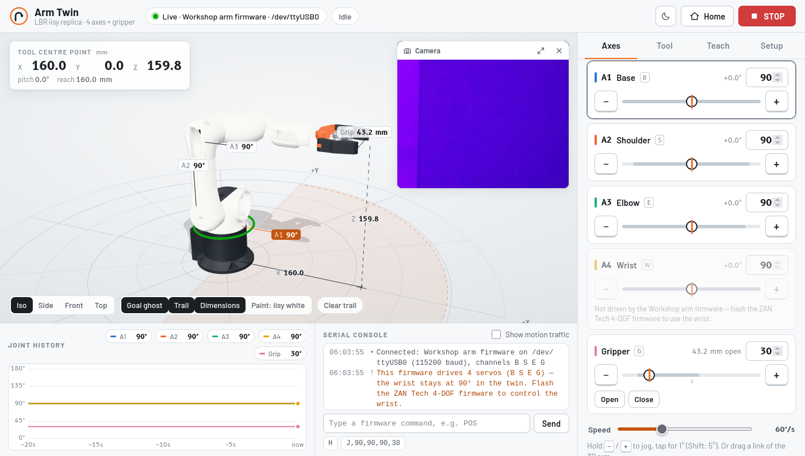
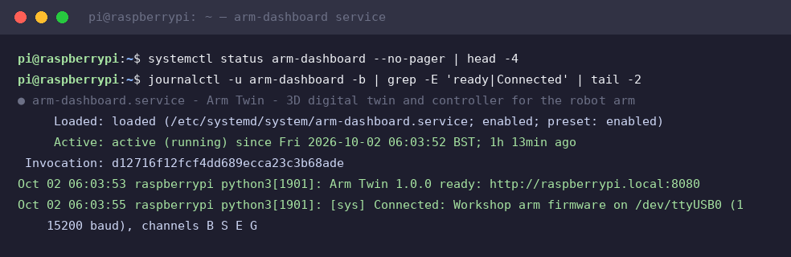
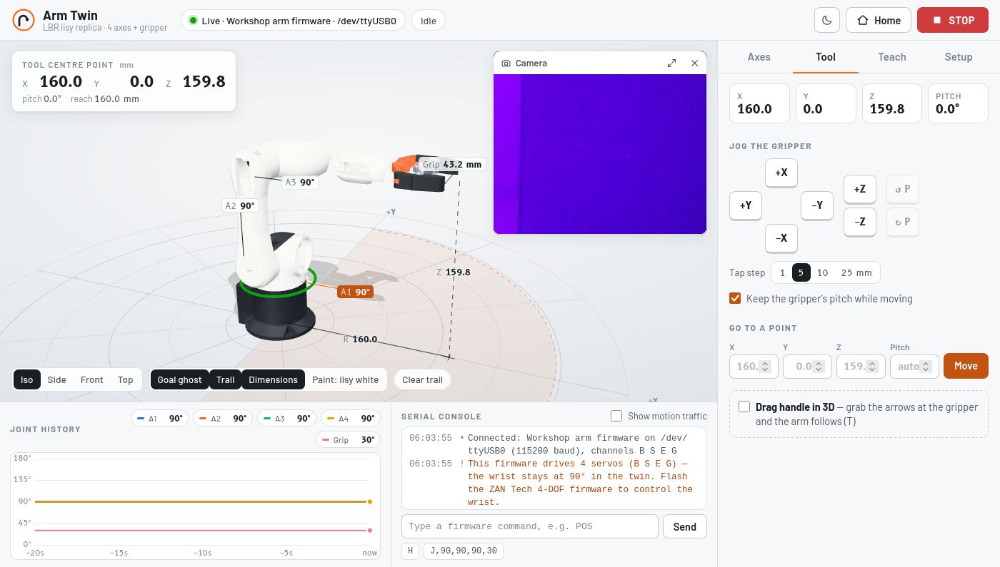
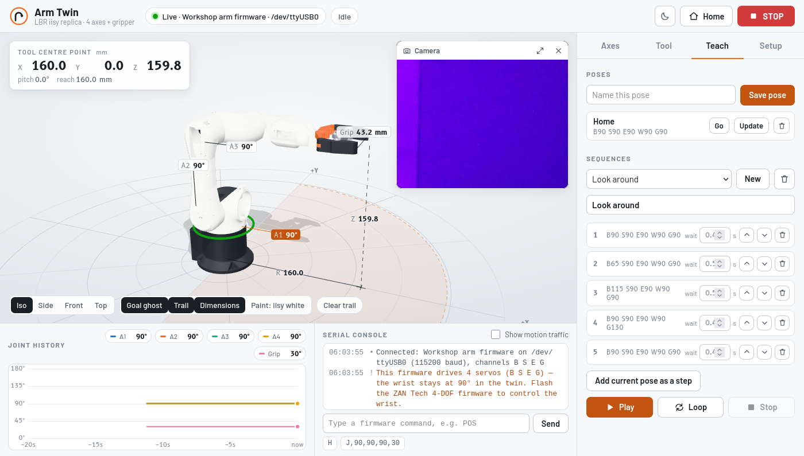
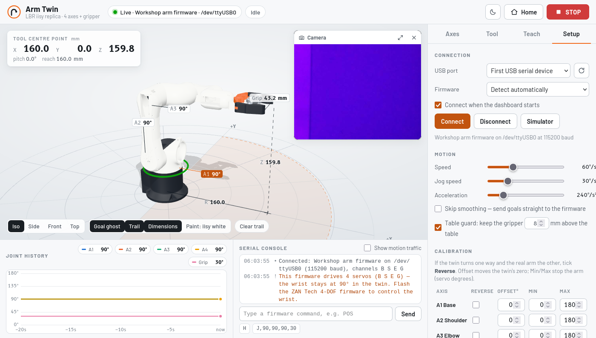

# Appendix — the Arm Twin dashboard (port 8080)

Companion tool for modules 3–7 · A browser **3D digital twin and controller** for the
same 4-DOF arm the workshop builds. It runs on the Pi as `arm-dashboard.service`
(auto-starts on boot) and shows the arm as a live 3D model built from the
designer's own STL files — every command you send anywhere can be watched here.

**Open it:** `http://raspberrypi.local:8080` from any laptop, tablet or phone on
the same network.

```
browser ── HTTP + live stream ──► Pi: server.py ── USB serial ──► Arduino Nano ──► 4 servos
                                        └── camera picture comes from the camera dashboard (:8000)
```

Deployed on the bench Pi at `~/Desktop/arm-dashboard/` (server.py + static twin +
`arm-dashboard.service`). This page documents what it is and how it plays with the
workshop scripts.

## What you see



- **The twin.** Every printed part (base, links, covers, gears, bars, jaws) moves
  on the joint axes measured from the CAD files; the gripper linkage animates like
  the real four-bar.
- **Live dimensions.** Each joint shows its angle as a CAD-style arc (`A1`–`A5`);
  the gripper tip shows height `Z`, reach `R` and jaw opening; the top-left panel
  gives the tool-centre-point as X/Y/Z in mm.
- **Goal ghost.** A pale blue ghost arm shows where the arm is heading while the
  solid arm shows where the servos are now.
- **Joint history** (bottom left) plots the last 20 s of every servo; the
  **serial console** (bottom right) shows the Pi ↔ Nano traffic and lets you type
  firmware commands yourself.
- **Light ring:** green = idle, blue = moving, amber = connecting, red = problem.

The screenshot above is the real service on the bench Pi, connected to the module-3
workshop firmware over `/dev/ttyUSB0` (the wrist row is greyed out — the workshop
firmware drives 4 servos; more under *Firmware* below):



## Moving the arm

| Where | How |
|---|---|
| **Axes** tab (above) | slider / number per servo; `−`/`+` keys tap 1° (Shift 5°), hold to jog |
| **Tool** tab | jog the gripper in X/Y/Z (IK), "go to point", or drag the 3D handle |
| **Teach** tab | save poses, build sequences, play once or loop |
| 3D view | drag a link to rotate that joint; drag the jaws to open/close |
| **Home / Stop** | go to the home pose / soft-stop (the servo power switch stays the real e-stop) |





A **table guard** (Setup → Motion, on by default) refuses any pose that would
bring the gripper within 8 mm of the table — the same "clamp twice" philosophy as
module 3, now in a third layer.

## Setup tab — connection, calibration, and the port-sharing rule



- **Connection:** which USB port, which firmware flavour, and **Disconnect**.
- **Calibration:** per-axis Reverse / Offset / Min / Max, gripper open/close
  angles, "use current pose as Home". Stored in `data/settings.json`.
- **The port-sharing rule (important for the workshop):** the dashboard keeps
  `/dev/ttyUSB0` while connected. Before running module 2/3/5/6 scripts or an
  `arduino-cli upload`, press **Disconnect** here (or
  `sudo systemctl stop arm-dashboard`) — otherwise they fail with
  `Device or resource busy`. Press Connect afterwards to hand the port back.
  The RC dashboard (:8081) degrades to dry-mode automatically for the same reason.

## Firmware: two flavours, auto-detected on Connect

| | Workshop firmware (modules 2–7) | ZAN Tech 4-DOF firmware |
|---|---|---|
| Serial | 115200 baud, `J,b,s,e,g` → `OK`/`ERR` | 9600 baud, `B90 S90 E90 W90 G90` |
| Servos | 4: B S E G (D3 D5 D6 D9) — **no wrist** | 5: adds the wrist (D10) |
| Motion | all joints together, 15 ms/degree | one servo after another |

The Nano on the bench runs the **workshop** firmware, so modules 5–7 keep working
unchanged — the wrist row stays greyed out in the twin. Flash the ZAN Tech
firmware to drive the wrist, and re-flash the workshop one before the PickBot
modules. The dashboard detects which one is on the port at Connect time.

## Service commands

```sh
systemctl status arm-dashboard           # is it running?
sudo systemctl restart arm-dashboard     # after editing files
sudo systemctl stop arm-dashboard        # free /dev/ttyUSB0 for uploads/scripts
journalctl -u arm-dashboard -f           # its log
```

By hand instead: `cd ~/Desktop/arm-dashboard && ./start.sh` (add `--sim` for a
simulator that never touches the USB port).

## Teaching with it

- Module 3 calibration gets a visual feedback loop: nudge `calibrate.py` poses and
  watch the arcs/limits on the twin before touching the real arm.
- The **serial console** is the module-2 protocol made visible — students see
  `J,...` go out and `OK` come back with their own eyes.
- The ghost-vs-solid pair demonstrates latency and ramping (slide 38's
  wait-for-OK pattern) better than any slide.

## Verified on the bench

2026-10-02 session: service auto-started after boot, auto-connected to the
workshop firmware (`channels B S E G`), twin rendered with live TCP readouts
(X 160.0 · Y 0.0 · Z 159.8 mm at the home pose), all four tabs exercised, and the
RC dashboard's dry-mode fallback confirmed while this service held the port.
Raw transcripts: [`verify/session-2026-10-02/`](../verify/session-2026-10-02/).

Related: [Module 3 — the 4-DOF arm](03-arm.md) · [Module 8 — RC Color Pilot](08-rc-car.md)
