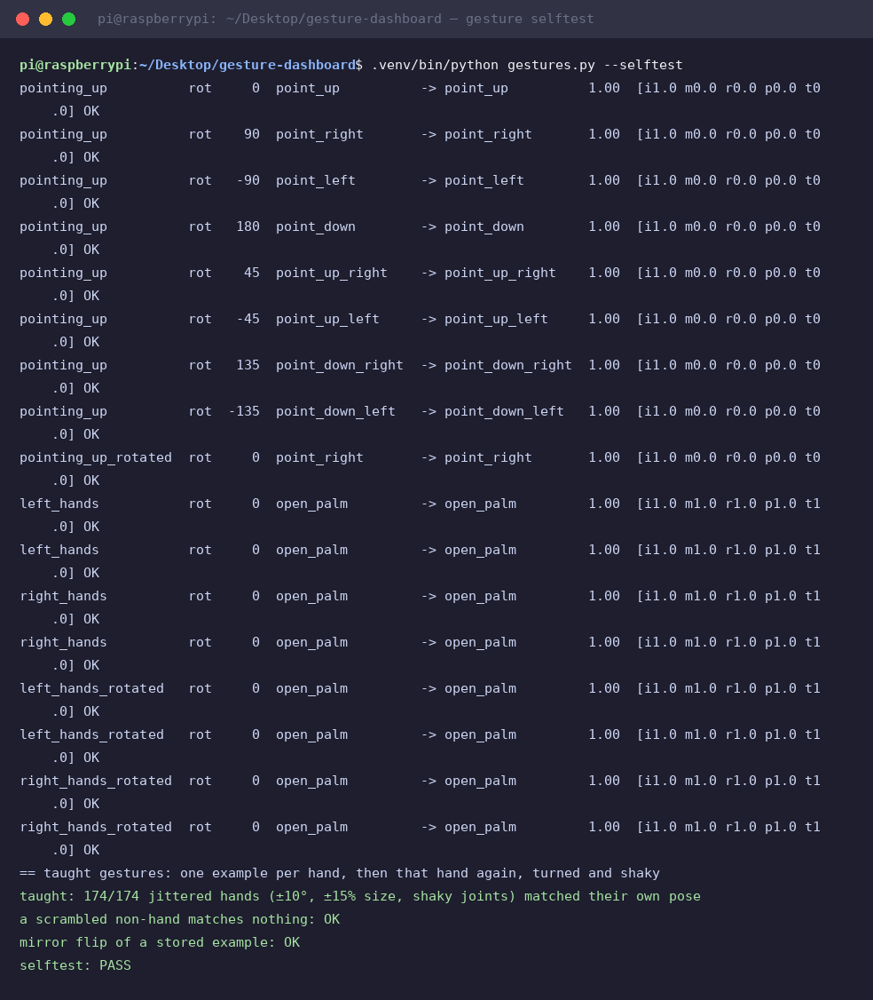
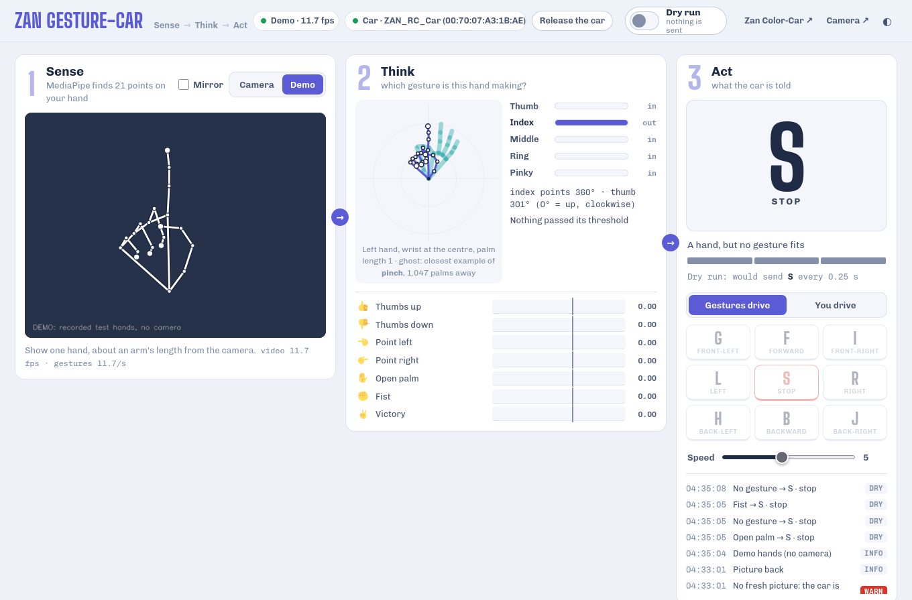
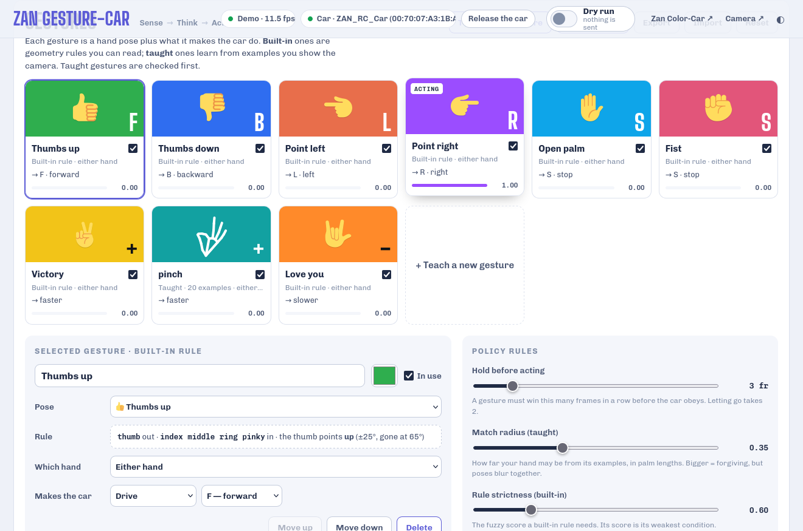
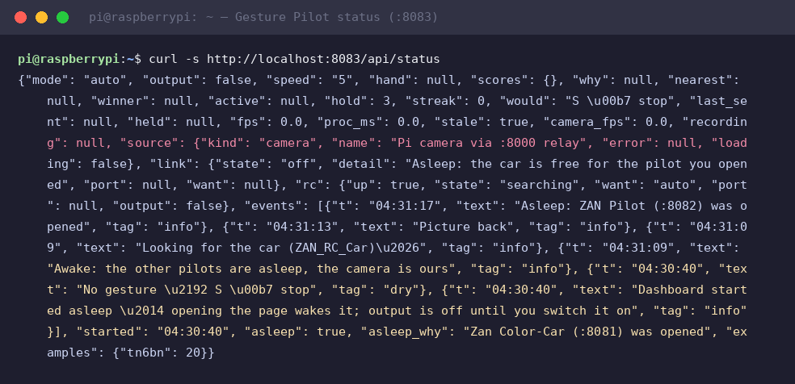

# Module 9 — Gesture Pilot: your hand drives the car

NEW project (module 8's car + module 6's gestures, one step up) · Result: show a hand
gesture to the Pi camera and the ZAN TriBot drives. Teach it **your own** gestures in
seconds, and change what each one does, live, in a dashboard on **:8083**.

## The AI you are actually teaching (say these words)

Module 8 tuned a classifier **by hand** (HSV thresholds). Here the classifier **learns
from examples you show it**, the step from rule-based AI to machine learning:

| Stage | What happens here | AI vocabulary |
|---|---|---|
| Sense | camera frame | observation |
| Think (perception) | MediaPipe finds the hand and 21 landmarks | **neural-network keypoint detection** (pose estimation) |
| Think (features) | wrist moved to 0, palm length scaled to 1 | **feature normalization**: position and size stop mattering |
| Think (classify, built-in) | "index out, others in, points left" → Point left | **rule-based classifier** with **fuzzy logic** (each condition 0..1, a rule = its weakest condition) |
| Think (classify, taught) | compare with every recorded example, k = 3 nearest | **k-nearest neighbours**, **few-shot learning**, **open-set rejection** (too far from everything = no gesture) |
| Think (decision) | gesture → car function table | **policy** |
| Act | `F`/`B`/`L`/`R`…/`1-9` over Bluetooth | action |
| Stability | a gesture must win 3 frames; letting go takes 2 | **temporal smoothing / debouncing** |

The honest one-liner: *the same sense–think–act loop as module 8, but the "think" box
now holds a neural network (MediaPipe) feeding a classifier that learns from 20 examples
instead of a threshold you typed.*

## Hardware

Nothing new: the module 8 car (ZAN TriBot, ESP32 `ZAN_RC_Car` on Bluetooth), the Pi
camera, and one hand. The camera faces **you** (not the floor): you stand in front of
the Pi and steer the car with your hand.

## Why the venv (a Pi 4 lesson)

The Pi 4's Cortex-A72 has no ARMv8 crypto extensions. mediapipe 1.x is compiled with
them and dies on the first frame: `This binary was compiled with aes enabled, but this
feature is not available on this processor`. **mediapipe 0.10.18** is the newest aarch64
wheel that runs on a Pi 4, and it has no wheel for trixie's Python 3.13. So `install.sh`
makes a venv with Python **3.12** (fetched by `uv`) and mediapipe 0.10.18. The lite hand
model (`model_complexity=0`) runs at **~60 ms per frame on one core** with a hand in view
(measured on the bench Pi with a compile running beside it). The newer Tasks API took
~190 ms for the same frame, so the dashboard uses the classic `mp.solutions.hands`.

Two more speed tricks, both in `server.py`:

- **The video never waits for the AI.** The page gets the camera's own JPEGs passed
  straight through (30 fps, nothing re-encoded) and draws the skeleton itself, from
  results the Pi pushes the moment each frame is analysed (`/api/live`, Server-Sent Events).
- **Two MediaPipe workers** take turns on the newest frames. MediaPipe releases Python's
  GIL, so they really run in parallel: ~1.9× the gesture rate of one (measured 8.5 → 12.8
  analysed frames/s with no hand in view, the slowest case). Results are applied in
  frame order. Set **Engine → 1 core** under Policy rules to leave more CPU to the
  other dashboards.

## Install

```bash
cd ~/Desktop/pi_workshop/code/09_gesture_car/dashboard
bash install.sh                  # ~/Desktop/gesture-dashboard + venv (a few minutes once)
sudo bash install.sh --service   # boot service gesture-dashboard on :8083
```

It reads the camera from the camera-dashboard relay (`http://127.0.0.1:8000/stream`,
**no** parameters, so it never restarts the camera under the Color Pilot), and it never
opens the sensor itself.

## The dashboard — http://raspberrypi.local:8083/

| Panel | Shows |
|---|---|
| **1 Sense** | the camera (mirrored: your left is the screen's left) with the hand skeleton drawn in |
| **2 Think** | your hand **normalized** (wrist at the centre, palm length 1), with the closest taught example as a coloured ghost; which fingers are out; where the index finger and thumb point; every gesture's score with its threshold mark |
| **3 Act** | what the car is told, hold progress, the byte on the wire, Gestures drive / You drive (D-pad), speed, event log |
| **Gestures** | the library: one card per gesture (pose + action + live score) |
| **Policy rules** | hold frames, match radius (taught), rule strictness (built-in), Lite/Full model, engine 1 or 2 cores, what "no gesture" means |

### Starter gestures (point where you want to go, open hand to stop)

| Gesture | Car | | Gesture | Car |
|---|---|---|---|---|
| 👍 Thumbs up | `F` forward | | ✋ Open palm | `S` stop |
| 👎 Thumbs down | `B` backward | | ✊ Fist | `S` stop |
| 👈 Point left | `L` left | | ✌️ Victory | one step **faster** |
| 👉 Point right | `R` right | | 🤟 Love you | one step **slower** |

No hand, no matching gesture, or no fresh picture for 1 s → `S`.

### Add, change, delete

- **Teach a new gesture**: name it, choose what it does, press **Record 20 examples**,
  then hold the pose up after the 3-2-1 and move it a little (closer, further, slightly
  turned). It works the moment recording ends. **Add 10 more** to improve it; hover an
  example thumbnail and press ✕ to drop a bad one; **Clear all** to start over.
- **Add a built-in**: 20 readable rules (open palm, fist, thumbs up/down/left/right,
  point in 8 directions, victory, three, rock on, love you, call me, OK).
- **Change**: name, colour, which hand (either / left only / right only), what it does:
  a drive key (`F B L R G I H J S`), a set speed (1-9, turbo), or faster/slower. For a
  built-in you can also swap the pose.
- **Delete** a gesture, **untick** it to park it, **Export / Import** the whole library
  (examples included) as JSON, **Reset** to the starter set.

Everything saves to `~/Desktop/gesture-dashboard/data/gestures.json` within a second.

**How the winner is chosen:** taught gestures are checked first. If one is within the
match radius, the nearest wins; otherwise the best built-in rule above the strictness
wins. Your examples beat the generic rules.

Tips that matter: a direction is part of the pose (*point left ≠ point right*), and a
left hand is a mirror image of a right one, so record with each hand you will use, or set
the gesture to one hand.

### Sharing the one car with the Color Pilot

The ESP32 accepts **one** Bluetooth driver. The Gesture Pilot starts with the car
**released**. **Take the car** asks the Color Pilot (:8081) to let go, then connects.
**Release the car** hands it back (:8081 starts looking again by itself).

## Testing procedure (in this order)

| Step | How | Pass when |
|---|---|---|
| 1 | `.venv/bin/python gestures.py --selftest` | 29/29 labelled MediaPipe test hands, 174/174 jittered taught matches, `selftest: PASS` |
| 2 | page → **Demo** source | recorded test hands play; cards light up; event log shows F/L/R/B/S, Victory → faster |
| 3 | **Camera**, output off | your thumbs up / point left… win in Think; event log says `dry` |
| 4 | Teach a gesture, record 20 | its card shows your average pose; it wins with its action |
| 5 | **Take the car**, car on blocks (wheels off the table), output on | wheels follow your hand; hand away → stop |
| 6 | floor, open space | drive a lap; Space or Esc = output off |

## Safety

- Output starts **off** after every restart; Space / Esc on the page turns it off.
- Drive keys are re-sent every 250 ms only **while** a gesture is held. Stopping needs
  only 2 frames, starting needs the hold.
- The TriBot firmware has **no fail-safe**: if the Pi dies mid-drive, the car keeps its
  last key. Give it open floor, and test on blocks first.

## Challenge: Gesture Slalom

Teams teach **their own** four gestures (no built-ins allowed), then steer through a cone
slalom. Fastest clean run wins; touching a cone = +5 s. Bonus: one gesture that sets turbo
only works with the left hand.

## What you learned

- A neural network (MediaPipe) turns pixels into **21 keypoints**; simple maths on those
  keypoints is enough for gestures.
- **Normalization** makes features ignore where and how big the hand is, but keep what
  matters (direction).
- **k-nearest neighbours** learns from 20 examples in a second, with no training run,
  and says "none of these" when nothing is close.
- Hardware decides software: the Pi 4's CPU picked our MediaPipe version.

## Verified on the bench (2026-10-03)

Selftest on the deployed copy — every labelled MediaPipe test hand classified
correctly, all 174 jittered taught examples matched, a scrambled non-hand and a
mirror-flip both rejected:



The live dashboard with the **Demo** source playing the recorded test hands:
Sense (skeleton drawn), Think (normalized hand + per-gesture scores), Act
(command card, hold meter, event log):



The gesture library — one card per gesture: pose, action, built-in rule or
taught, live score with its threshold mark:



Status over REST — the asleep/wake handshake with the other pilots, dry output,
camera via the :8000 relay (it never opens the sensor itself):



Raw transcripts: [`verify/session-2026-10-03/`](../verify/session-2026-10-03/).
