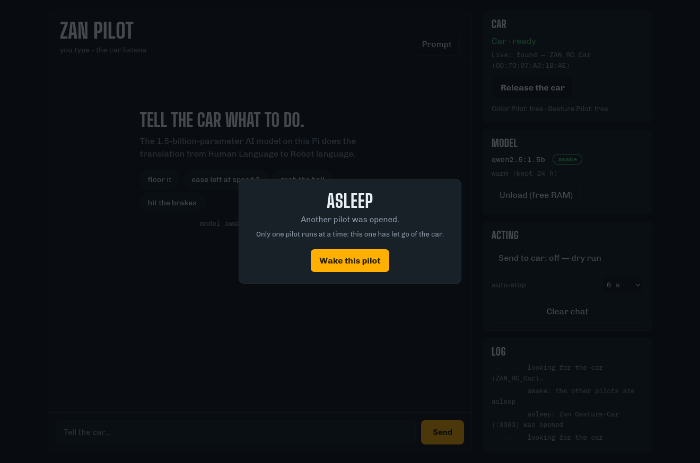
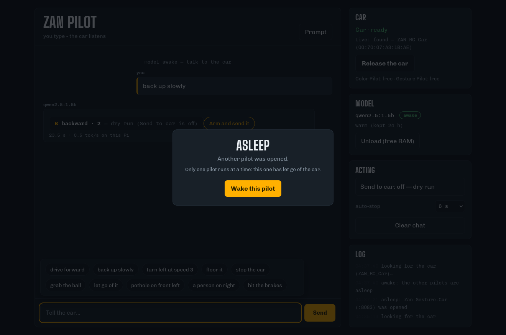
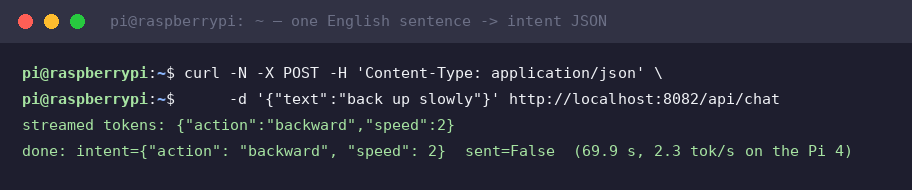
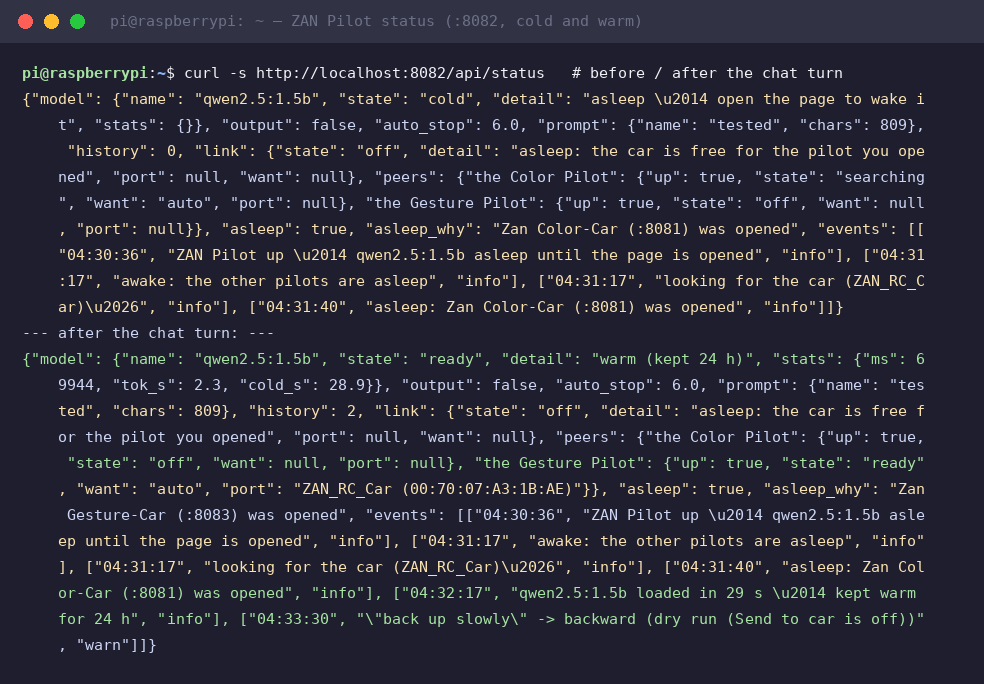

# Module 10 — ZAN Pilot: an LLM drives the car (Stage 3)

The third pilot on the rig · Result: **you type English** — *"back up slowly"*
— and a 1.5-billion-parameter language model running **on this Pi** turns it
into the car's drive command. The last step of the course's AI ladder:
thresholds (module 8) → keypoints + k-NN (module 9) → **a natural-language
agent**.

```
you type English → qwen2.5:1.5b in Ollama (this Pi) → intent JSON
                → TriBot drive key (F/B/L/R/S + speed 1–9) → Bluetooth
```

**Open it:** `http://raspberrypi.local:8082` · Status also at `/api/status`.
Deployed at `~/Desktop/llm-dashboard/` (runs as a **user** service,
`systemctl --user enable --now llm-dashboard`); the benchmark that picked the
model and the prompt lives in `~/Desktop/stage3-llm/` (`bench.py`).

## The AI you are actually teaching (say these words)

| Stage | What happens here | AI vocabulary |
|---|---|---|
| Sense | your sentence | **prompt** |
| Think | qwen2.5:1.5b generates **only** a small JSON | **constrained generation / structured output** — the prompt pins the grammar |
| Think | `{"action":"backward","speed":2}` | **intent recognition** — the LLM as a semantic parser |
| Act | JSON → drive key + speed → Bluetooth | action |
| Safety | auto-`S` after N seconds; dry-run by default | **guardrails** on an autonomous agent |

The honest one-liner: *the model is not "driving" — it is translating. The
policy is still a table (module 8); what changed is the input: pixels and
poses gave way to language.* And because the model runs locally on a Pi 4,
this is also a lesson in **edge AI** — 1.5 B parameters, quantized, ~2 tok/s
on four Cortex-A72 cores, no cloud.

## How it behaves

- **Cold start is lazy.** The model loads the first time someone opens the
  page (~30–45 s), then stays in RAM for 24 h (`keep_alive`) — later replies
  take seconds. "Unload (free RAM)" puts it back to sleep.
- **The prompt is yours.** The Prompt drawer shows the system prompt; the
  "Tested" preset scored **12/12 actions** on the workshop command set
  (`bench.py`); "Terse" is faster, "Extended" tolerates chatter and politeness.
- **Dry run by default.** "Send to car: on" must be flipped before anything
  reaches the car — the same rule as the other two pilots.
- **Auto-stop.** After a drive key goes out, an `S` follows N seconds later
  (6 s default) so a misunderstood sentence cannot run away.
- **One car, three pilots.** "Take the car" asks the Color Pilot (:8081) and
  the Gesture Pilot (:8083) to let go first; an idle pilot hands the car back.
  Opening a page wakes that pilot and puts the others to sleep — the whole
  handover is visible in each page's event log.

## Verified on the bench (2026-10-03)

The page awake, the car found over Bluetooth (`ZAN_RC_Car`), model warm, both
peer pilots free, dry-run armed:



One real sentence typed into the page — the reply streams back, the intent is
extracted, and the ACTING panel shows exactly what would be sent and why it
isn't:



The same turn over REST (raw SSE): streamed tokens assemble the intent JSON,
and the `done` event carries the decision, the dry-run flag, and the honest
Pi-4 timing:



Cold vs warm status around that turn — note the events: model loaded in 29 s,
kept warm, `"back up slowly" -> backward (dry run)`:



Raw transcripts: [`verify/session-2026-10-03/`](../verify/session-2026-10-03/)
(`m10-status-cold.txt`, `m10-warm.txt`, `m10-chat.txt`, `m10-status-warm.txt`).

## Classroom script

1. Ask the class: *"how would YOU turn 'back up slowly' into car commands?"*
   Collect their rules — then show the Prompt drawer: that is all the model
   knows about the car too.
2. Type a sentence from the chips (`floor it`, `a person on right`, `hit the
   brakes`) — watch the JSON stream token by token.
3. Break it: slang, typos, two commands in one sentence — discuss why the
   guardrails (dry-run, auto-stop) exist.
4. Compare the three pilots side by side: same loop, three different "think"
   boxes — thresholds, keypoints, language.

Related: [Module 8 — RC Color Pilot](08-rc-car.md) · [Module 9 — Gesture Pilot](09-gesture-pilot.md)
